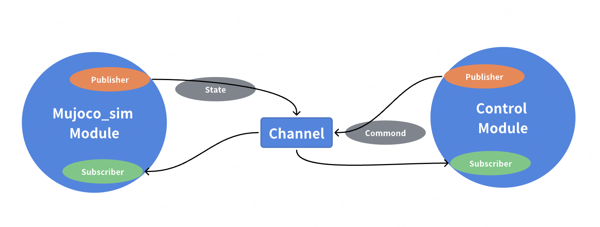

# 第1章 快速开始

## 1.1 项目介绍
Aimrt_Mujoco_Sim 旨在为机器人开发者提供一个快速上手的仿真平台，其物理引擎使用 `mujoco`， 通信框架使用 `AimRT`。 用户仅需要书写配置文件即可快速启动仿真。Aimrt_Mujoco_Sim 本质为一个 AimRT 模块， 它可以与其他 AimRT 模块 或者 ROS2 节点通过特定的消息类型通信，实现参数控制和状态获取。



## 1.2 安装说明

### 1.2.1 环境与依赖 (dependencies)
- 环境（参考 [AimRT 安装与引用](https://docs.aimrt.org/v0.10.0-rc1/tutorials/quick_start/installation_cpp.html)， 以选择合适的开发环境）

    - cmake 3.24+
    - gcc 11.4+
    - clang 15.0.7+
    - 操作系统： 推荐 Ubuntu 22.04

- 依赖 （在构建过程均通过 cmake 自动下载）

    | 依赖名称 | 版本        | 说明     | git地址                                |
    | -------- | ----------- | -------- | -------------------------------------- |
    | AimRT    | 0.10.0-rc1+ | 通信框架 | https://github.com/AimRT/AimRT.git     |
    | mujoco   | 3.1.6       | 物理引擎 | https://github.com/deepmind/mujoco.git |


### 1.2.2 构建并安装 (build and install)

在项目根目录下，执行以下命令编译：

```shell
./build.sh \
  -DAIMRT_MUJOCO_SIM_INSTALL=ON \           # 是否生成安装包
  -DCMAKE_INSTALL_PREFIX=./build/install \  # 安装路径（默认：当前目录的 build/install）
  -DAIMRT_MUJOCO_SIM_BUILD_WITH_ROS2=ON \   # 是否启用 ROS2 支持
  -DAIMRT_MUJOCO_SIM_BUILD_TESTS=OFF \      # 是否编译测试用例
  -DAIMRT_MUJOCO_SIM_BUILD_EXAMPLES=ON      # 是否编译示例程序
```

### 1.2.3 运行 (run)
进入到 build 目录下，执行以下命令运行 example：

```shell
./start_examples_inverted_pendulum_with_pid_control.sh
```
当弹出 mujoco 可视化界面并看到倒立摆模型运动时，说明运行成功。

## 1.3 项目结构
``` shell
AIMRT_MUJOCO_SIM/
├── build/                   # 构建目录
├── cmake/                   # 相关依赖下载
├── document/                # 项目使用文档
├── src/                     # 源代码目录
│   ├── example/             # 示例代码
│   ├── module/              # aimrt_mujoco_sim 模块
|   │   ├── publisher/          # 用于发布各种消息类型的状态
|   │   └── subscriber/         # 用于订阅各种消息类型的控制指令
│   ├── pkg/                 # 包管理
│   ├── protocols/           # 消息协议类型
|   │   └── example/            # 用于 example 的协议定义
│   └── CMakeLists.txt       # src 目录的 CMake 配置
└── CMakeLists.txt           # 项目根目录的 CMake 配置
```

<a href="/path/to/home" style="
    display: inline-block;
    padding: 8px 16px;
    background: linear-gradient(135deg, #6B48FF, #00A3FF);
    color: white !important;
    border-radius: 25px;
    text-decoration: none;
    transition: transform 0.2s, box-shadow 0.2s;
    box-shadow: 0 4px 6px rgba(0, 0, 0, 0.1);
">🚀 返回主目录</a>

