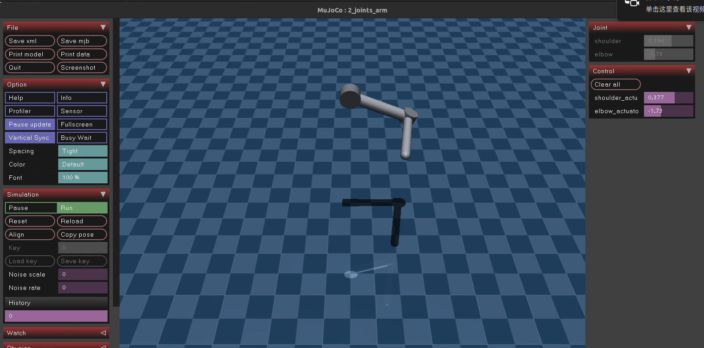
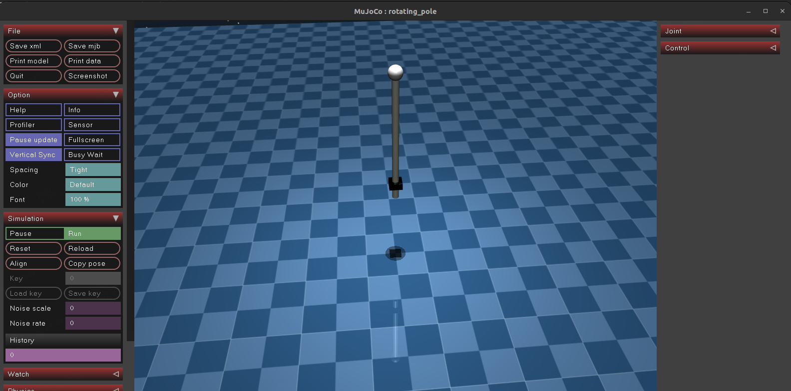
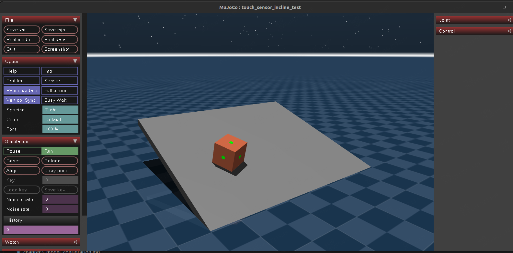
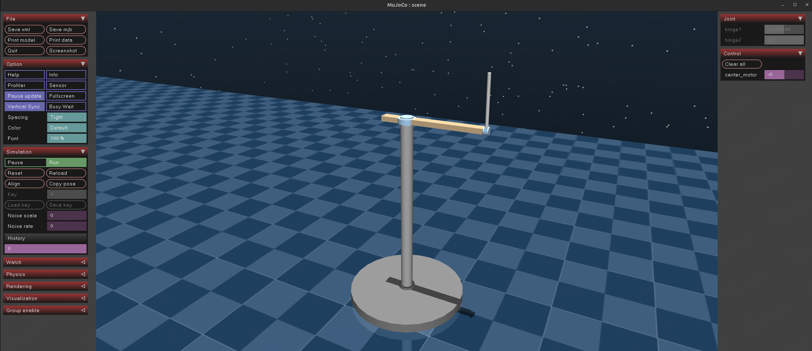
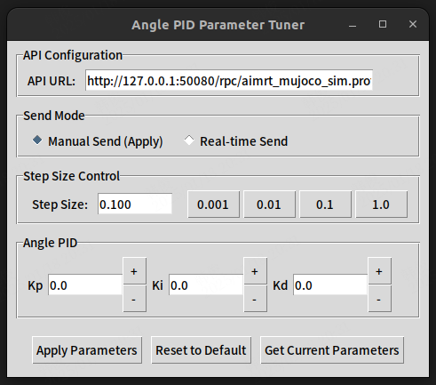

# 第4章 示例


## 4.1 传感器使用示例(example/hardware)
### 4.1.1 joint 传感器与驱动器

该示例演示了如何使用 joint 传感器驱动器用来驱动双关节机械臂，并在终端定频输出关节位置状态。用户可通过在 build 目录下输入以下指令执行：
```shell
# 使用 protobuf 协议
./start_examples_hardware_joint_pb.sh
```
```shell
# 使用 ros2_msg 协议
./start_examples_hardware_joint_ros2.sh
```
用户可进入 build/tools 目录下执行以下指令发送关节控制指令
```shell
# 若使用 protobuf 协议
./pb_joint_command_tool.sh <肩关节位置> <肘关节位置>
```
```shell
# 若使用 ros2_msg 协议
./ros2_joint_command_tool.sh <肩关节位置> <肘关节位置>
```


### 4.1.2 imu 传感器

该示例演示了如何使用 imu 传感器获取机器人姿态信息，并在终端定频输出姿态信息。用户可通过在 build 目录下输入以下指令执行：

```shell
# 使用 protobuf 协议
./start_examples_hardware_imu_pb.sh
```
```shell
# 使用 ros2_msg 协议
./start_examples_hardware_imu_ros2.sh
```
### 4.1.3 touch 传感器

该示例演示了如何使用 touch 传感器获取机器人触摸信息，并在终端定频输出接触力信息。用户可通过在 build 目录下输入以下指令执行：
```shell
# 使用 protobuf 协议
./start_examples_hardware_touch_pb.sh
```
```shell
# 使用 ros2_msg 协议
./start_examples_hardware_touch_ros2.sh
```
## 4.2 倒立摆(example/inverted pendulum)

### 4.2.1 模型介绍

倒立摆由基座、支架、水平旋转杆以及竖直摆杆组成。整个装置只有一个电机用于驱动水平旋转杆的转动。此外，在水平旋转杆和竖直摆杆上个安装有速度和角度的传感器，用于测量其转动期间的速度和角度等状态信息。



希望通过控制水平旋转杆的转动，使摆杆尽快倒立并保持稳定。


### 4.2.2 控制算法
该示例通过简单的单环 PID 控制器来控制水平旋转杆的转动。用户可通过从项目根目录下进入`./build`目录，执行
```shell
python3 ./tools/inverted_pendulum_pid_gui.py
```
开启倒立摆 PID 算法控制界面，方便用户进行参数设置和控制。在该界面设有：
- API Configuration：其中API URL 用于和指定服务进行通信
- Send Mode: 选择发送模式，有两种模式：
  - Manual Send: 需要手动点击`Apply Parameters`按钮发送指令 
  -  Real-time Send: 只要通过`+`号或者 `-`号按钮调整参数，立即发送指令
- Step Size Control: 设定步长（必须为正数），即每一步调整的幅度,除了默认的四个数值之外，用户可在输入款输入自定义步长
- Angle PID：设定角度 PID 控制器的参数，包括`P`、`I`、`D`三个参数
- Reset to Default：恢复默认参数。可以通过点击`+`号或者 `-`号按钮调整参数，也可直接在输入框输入自定义参数
- Get Current Parameters：获取当前参数值 （程序运行默认设置 P=25000, I=0, D=120）


